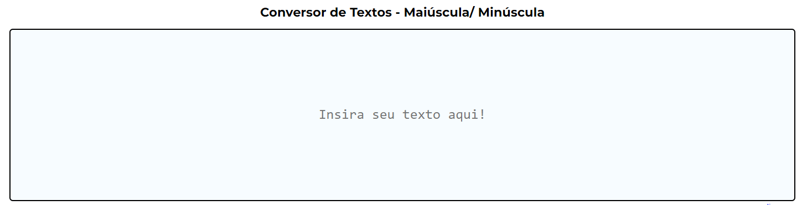

## 
 Text Converter Tool

* Projeto Publicado: https://txtconverter.dailysimpletools.com

## Descrição do projeto
Text converter é um conversor de textos para letras maiúsculas ou minúsculas de acorde com a opção desejada pelo usuário. O objetivo de desenvolver esse projeto foi praticar o desenvolvimento com React, utilizando gerenciamento de estado para os componentes utilizados. Nesse projeto, mative todos os textos utilizados no HTML em um arquivo JSON, assim pude estruturar os dados e já deixá-los traduzidos para o inglês. Com o gerenciamento de estados com Recoil, fiz a opção no menu de linguagem (bandeira do Brasil para pt_br e dos EUA para en) para o usuário escolher. Com a escolha, o site já altera de forma dinâmica todos os textos da página.

## Funcionalidades
* Conversor de texto para maiúsculas ou minúculas com quatro opções principais;
  * Converter todo texto para maiúscula;
  * Converter todo texto para minúscula;
  * Converter primeira letra de cada palavra para maiúscula;
  * Converter primeira letra de cada frase para maiúscula;
* Disponibilizar duas opções de personalização;
  * Ignorar palavras de tamanho específico e menores (para função de primeira letra de cada palavra maiúscula);
  * Ignorar (manter o padrão) de palavras específicas digitadas pelo usuário no ultimo campo de input;

## Ferramentas utilizadas
* Vercel para publicar projeto;
* Recoil para gerenciamento de estados;
* ESLint para padronização do código;

## Tecnologias utilizadas
* 
* 

## Autores
| [ Diego Ferreira](https://github.com/diegonf) | 
| :---: |